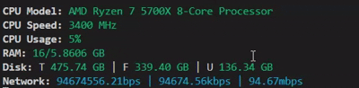

# sysPulse

**sysPulse** is a simple, open-source CLI system monitor that you can run directly from your terminal while coding. It lets you keep an eye on your system without leaving your IDE.

## Story

This project started with an old laptop with only **4 GB of RAM**. I was constantly dealing with lag when working with Node.js, and whenever I wanted to check my CPU, RAM, storage, or network usage, I had to leave my IDE and open Task Manager just to check my system performance.

So I thought:

> Why not build a CLI that lets me monitor my system directly from the terminal while I code?

And that's how **sysPulse** started.

The goal is to make system monitoring simple and accessible directly from your development environment.

Currently, sysPulse can display information such as:

- CPU usage and information
- RAM usage
- Storage information
- Network speed

## Open Source

**sysPulse is still in its early stages**, so there is plenty of room for improvement.

If you have an idea for a feature, notice something that's missing, or want to improve the project, feel free to contribute. Don't wait for a "final" version  help make it better.

## Requirements

Make sure you have **Node.js** installed on your device.

## Run sysPulse

After installing the project, run:

```bash
sysPulse
```

## Preview

